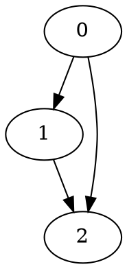

Нижче – готовий текст звіту, який ти можеш вставити у Word/Google Docs і при потребі підправити під формат кафедри (шапку, підписи до рисунків, нумерацію тощо).

---

## 1. Мета роботи

Ознайомитися з основними способами подання орієнтованих графів у пам’яті комп’ютера, реалізувати алгоритми обходу графів (DFS, BFS) для різних структур даних, навчитися обчислювати радіус графа та знаходити всі прості орієнтовані цикли. Провести експериментальний аналіз часу роботи розроблених алгоритмів на графах різного розміру.

---

## 2. Постановка задачі

Згідно з варіантом лабораторної роботи необхідно було реалізувати такі завдання:

1. **Завдання 1 (1 бал).**
   Реалізувати функції зчитування орієнтованого графа з `.dot`-файлу у трьох представленнях:

   * матриця інцидентності (двовимірний список Python);
   * матриця суміжності (двовимірний список);
   * словник суміжності (словник вигляду `вершина: [список суміжних вершин]`).

2. **Завдання 2 (1 бал).**
   Реалізувати рекурсивний алгоритм пошуку в глибину (DFS) для:

   * графа, заданого матрицею суміжності;
   * графа, заданого словником суміжності.

3. **Завдання 3 (1 бал).**
   Реалізувати ітеративні алгоритми:

   * DFS для матриці суміжності та словника;
   * BFS для матриці суміжності та словника.

4. **Завдання 4 (додаткове, 0.5 бала).**
   Реалізувати знаходження радіусу графа для всіх способів подання графу.

5. **Завдання 5 (додаткове, 0.5 бала).**
   Реалізувати пошук усіх простих циклів у графі. Одна вершина може входити до кількох циклів.

6. **Завдання 6 (додаткове, 0.5 бала).**
   Виконати порівняльний аналіз часу роботи розроблених алгоритмів для різних розмірів вхідних даних, побудувати відповідні графіки (з використанням `matplotlib`), сформулювати висновки.

---

## 3. Теоретичні відомості

### 3.1. Подання графів

Орієнтований граф (G = (V, E)) складається з множини вершин (V) та множини орієнтованих ребер (E \subseteq V \times V).

Основні способи подання:

1. **Матриця суміжності** – квадратна матриця розміру (n \times n), де (n = |V|).

   * Елемент (a_{ij} = 1), якщо існує ребро з вершини (i) у вершину (j);
   * (a_{ij} = 0), інакше.
     Перевага – простота; недолік – займає (O(n^2)) пам’яті, навіть якщо граф розріджений.

2. **Матриця інцидентності** – матриця розміру (n \times m), де (n = |V|), (m = |E|).

   * Для орієнтованого графа в стовпчику, що відповідає ребру (e = (u, v)), ставимо (-1) у рядку вершини (u) (початок) і (1) у рядку вершини (v) (кінець), інші елементи 0.

3. **Список/словник суміжності** – для кожної вершини зберігається список сусідів, у які з неї виходять ребра. У реалізації використовувався словник:

   ```python
   { вершина: [список сусідів] }
   ```

   Це пам’яттєво ефективне подання для розріджених графів.

### 3.2. Обхід графа в глибину (DFS)

**DFS (Depth-First Search)** — алгоритм обходу, який намагається «йти якнайглибше» за ребрами, перш ніж повертатися назад.
Властивості:

* може бути реалізований **рекурсивно** (стос викликів функції) або **ітеративно** (власний стек);
* складність для списку суміжності: (O(|V| + |E|)).

### 3.3. Обхід графа в ширину (BFS)

**BFS (Breadth-First Search)** — алгоритм, який обходить граф шарами: спочатку всі вершини на відстані 1 від старту, потім 2 і т.д.
Властивості:

* природно реалізується через чергу (у роботі використано два «шари» – поточний і наступний);
* дозволяє знайти мінімальну кількість ребер від стартової вершини до всіх інших (у незаважених графах).

### 3.4. Ексцентриситет і радіус графа

**Ексцентриситет вершини** (v) — максимальна відстань від цієї вершини до всіх інших вершин, до яких існує шлях:
[
ecc(v) = \max_{u \in V} dist(v, u)
]

**Радіус графа** — мінімальний ексцентриситет серед усіх вершин:
[
rad(G) = \min_{v \in V} ecc(v)
]
Для знаходження радіуса можна від кожної вершини запустити BFS, визначити її ексцентриситет, а потім взяти мінімум.

### 3.5. Цикли в орієнтованому графі

Орієнтований цикл — це послідовність вершин (v_0, v_1, \dots, v_k, v_0), де:

* всі вершини (v_0, \dots, v_k) різні (простий цикл),
* для кожної пари сусідніх вершин ((v_i, v_{i+1})) існує орієнтоване ребро,
* цикл повертається в початкову вершину.

Задача знаходження всіх простих циклів має потенційно експоненційну складність у найгіршому випадку, адже кількість циклів у графі може бути дуже великою.

---

## 4. Опис програмної реалізації

Усі функції реалізовано мовою **Python**. Для вимірювання часу використано модуль `time`, для побудови графіків – `matplotlib.pyplot`. Перевірка коректності базових функцій здійснюється через `doctest`.

### 4.1. Зчитування графа з `.dot` файлу

Граф у файлі зберігається в синтаксисі `dot`, наприклад:



Рядок з відкриттям (`digraph ... {`) і закривною дужкою (`}`) ігноруються через `file_content[1:-1]`.

#### 4.1.1. Матриця інцидентності — `read_incidence_matrix`

* Прохід по всіх ребрах, визначення максимальної вершини `matrix_size`.
* Ініціалізація матриці розміром `matrix_size × m`, де `m` – кількість ребер.
* Для кожного ребра `start -> end`:

  * `matrix[start][index] = -1`
  * `matrix[end][index] = 1`

#### 4.1.2. Матриця суміжності — `read_adjacency_matrix`

* Аналогічно спочатку визначається кількість вершин.
* Створюється `matrix_size × matrix_size` з нулями.
* Для кожного ребра `start -> end` у відповідному елементі матриці ставиться `1`.

#### 4.1.3. Словник суміжності — `read_adjacency_dict`

* Створюється словник `adjacency_dict`.
* Для кожного ребра `start -> end` викликається:

  ```python
  adjacency_dict.setdefault(start, []).append(end)
  ```
* Наприкінці словник сортується за ключами, щоб упорядкувати вершини.

### 4.2. DFS

#### 4.2.1. Ітеративний DFS для словника — `iterative_adjacency_dict_dfs`

* Використовується стек `stack` і список `visited`.
* Множина `not_visited` містить невідвідані вершини.
* `possible_ways` – копія графа, з якої поступово видаляються вже відвідані вершини.
* Алгоритм імітує ручний рух по графу з поверненням назад по стеку, якщо з поточної вершини більше немає куди йти.

#### 4.2.2. Ітеративний DFS для матриці — `iterative_adjacency_matrix_dfs`

* Спочатку матриця переводиться у словник суміжності `dict_graph`.
* Далі виконується той самий алгоритм, що й у попередній функції.

#### 4.2.3. Рекурсивний DFS для словника — `recursive_adjacency_dict_dfs`

* Параметри: `graph`, `start`, `visited` (за замовчуванням `None`).
* Якщо `visited is None`, ініціалізується порожній список.
* Вершина `start` додається до `visited`.
* Для кожного сусіда, відсортованого за зростанням, виконується рекурсивний виклик, якщо вершину ще не відвідано.
* Повертається список у порядку обходу.

#### 4.2.4. Рекурсивний DFS для матриці — `recursive_adjacency_matrix_dfs`

* Матриця перетворюється на словник суміжності `dict_graph`.
* Далі викликається вже описана функція `recursive_adjacency_dict_dfs`.

### 4.3. BFS

#### 4.3.1. Ітеративний BFS для словника — `iterative_adjacency_dict_bfs`

* Використовуються:

  * `visited` – список відвіданих вершин;
  * `current_layer` – поточний шар;
  * `next_layer` – вершини наступного шару.
* Поки `current_layer` не порожній, для кожної вершини з шару перебираються сусіди. Невідвідані додаються в `next_layer`.
* Результат – список вершин у порядку обходу в ширину.

#### 4.3.2. Ітеративний BFS для матриці — `iterative_adjacency_matrix_bfs`

* Матриця перетворюється на словник суміжності, далі використовується аналогічний алгоритм.

#### 4.3.3. BFS для обчислення відстаней — `bfs`

Ця допоміжна функція повертає не просто список відвіданих вершин, а словник `відстань: [список вершин на цій відстані]`.

* `vist` — список шарів, де `vist[0]` містить стартову вершину, `vist[1]` — вершини на відстані 1 тощо.
* Наприкінці формується словник типу `distance -> list_of_vertices`.

---

### 4.4. Обчислення радіуса графа

#### 4.4.1. `adjacency_matrix_radius`

* Матриця перетворюється у словник суміжності `dict_graph`.
* Для кожної вершини графа запускається `bfs(dict_graph, peak)` і обчислюється її ексцентриситет як `max(bfs(...).keys())`.
* Радіус — мінімальний з отриманих ексцентриситетів.

#### 4.4.2. `adjacency_dict_radius`

* Аналогічно попередній функції, але без перетворення матриці – одразу використовується список суміжності.

---

### 4.5. Пошук усіх циклів — `find_cycles`

Функція шукає всі прості орієнтовані цикли у графі, заданому словником суміжності.

Основні ідеї:

* `cycles` — список усіх знайдених циклів (кожен цикл — список вершин з повтором початкової вершини в кінці).
* `seen_cycles` — множина нормалізованих представлень циклів, щоб уникати дублікатів.
* `normalize_cycle`:

  * відкидає останню вершину (повтор початку),
  * циклічно зрушує список так, щоб найменша за номером вершина стала першою — це дозволяє розпізнати один і той самий цикл, який починається з різних вершин.
* `dfs(current, start, path, on_path)`:

  * обходить граф, будуючи всі шляхи, що повертаються у `start`;
  * якщо `neighbor == start`, формується цикл;
  * якщо `neighbor > start` і його ще немає в поточному шляху, продовжуємо DFS.

Зовнішній цикл по `start` запускає DFS з кожної вершини.

---

### 4.6. Генерація випадкового графа та порівняння часу роботи

#### 4.6.1. Генерація графа — `generate_random_digraph`

* Створюється словник `graph = {i: [] for i in range(n)}`.
* Для кожної пари вершин `(i, j)`, `i != j`, з імовірністю `p` додається ребро `i -> j`.
* Граф паралельно записується в `.dot` файл:

  ```python
  file.write('digraph sample_input {\n')
  ...
  file.write('}')
  ```

#### 4.6.2. Порівняння — `compare_functions`

* На вхід передається список розмірів графа `size` (у `main`: від 10 до 100 з кроком 10).

* Для кожного `n`:

  * генерується випадковий орієнтований граф;
  * вимірюється час виконання:

    * функцій зчитування (`read_incidence_matrix`, `read_adjacency_matrix`, `read_adjacency_dict`);
    * DFS (рекурсивного та ітеративного для словника/матриці);
    * BFS (для словника та матриці);
    * обчислення радіуса (через матрицю і через словник);
    * пошуку всіх циклів `find_cycles`.
  * час фіксується через `time.perf_counter()`.

* Після збору даних будуються графіки:

  * порівняння часу зчитування;
  * порівняння DFS;
  * порівняння BFS;
  * порівняння обчислення радіуса;
  * час знаходження всіх циклів.

Функція `main()` формує список розмірів `compare_list` і викликає `compare_functions`, а також запускає `doctest.testmod()` для перевірки прикладів з докстрінгів.

---

## 5. Порівняльний аналіз роботи алгоритмів

(Тут ти можеш вставити свої графіки як Рис. 1, Рис. 2 тощо.)

З теоретичної точки зору й очікуваної поведінки на практиці:

1. **Читання графу**

   * Запис у **словник суміжності** зазвичай буде ефективнішим за пам’яттю і часто швидшим, ніж побудова повної матриці суміжності, особливо для розріджених графів.
   * Побудова **матриці інцидентності** потребує більше оперативної пам’яті (розмір (n \times m)) і додаткових операцій запису.

2. **DFS**

   * Ітеративний та рекурсивний варіанти мають однакову асимптотичну складність (O(|V| + |E|)).
   * Реалізації, що працюють через **словник суміжності**, зазвичай швидші для розріджених графів, оскільки не потрібно щоразу пробігати весь рядок матриці з нулями.
   * Для великих графів ітеративний DFS може бути більш безпечним через відсутність ризику переповнення стеку рекурсії.

3. **BFS**

   * BFS для словника суміжності так само працює з ефективністю (O(|V| + |E|)) і, як правило, менш витратний, ніж непрямий варіант через матрицю (де спочатку створюється словник із матриці).

4. **Обчислення радіуса**

   * Обчислення радіуса передбачає запуск BFS з кожної вершини:
     сумарна складність ~ (O(|V| \cdot (|V| + |E|))).
   * Реалізація на словнику суміжності знову ж таки виглядає природніше й ефективніше для розріджених графів.

5. **Пошук усіх циклів**

   * Кількість циклів у орієнтованому графі може бути великою, тому час роботи швидко зростає з ростом числа вершин і щільності ребер.
   * На побудованому графіку (час знаходження циклів від розміру) очікується різкий ріст часу при збільшенні кількості вершин та ймовірності ребер.

---

## 6. Висновки

У ході виконання лабораторної роботи було:

1. Реалізовано зчитування орієнтованого графа з `.dot`-файлу у трьох формах подання: матриця інцидентності, матриця суміжності, словник суміжності.
2. Реалізовано алгоритми обходу графа:

   * DFS — рекурсивно та ітеративно для словника суміжності та матриці;
   * BFS — ітеративно для обох подань.
3. Реалізовано функції для обчислення радіуса графа через запуск BFS від кожної вершини.
4. Розроблено алгоритм пошуку всіх простих орієнтованих циклів у графі з використанням DFS та нормалізації циклів для уникнення дублікатів.
5. Проведено експериментальне порівняння часу роботи різних реалізацій на випадково згенерованих графах різного розміру та побудовано графіки залежності часу виконання від розміру вхідних даних.

У результаті:

* підтверджено, що подання графа через словник суміжності є більш зручним та ефективним для алгоритмів обходу та обчислення радіуса в розріджених графах;
* показано, що ітеративні та рекурсивні варіанти DFS мають однакову асимптотичну складність, проте рекурсивний варіант простіший для розуміння, тоді як ітеративний краще контролює використання пам’яті;
* продемонстровано, що задачі типу «знайти всі цикли» мають значно гіршу масштабованість за часом, ніж базові обходи або обчислення радіусу.

Отримані навички дозволяють надалі реалізовувати більш складні алгоритми на графах та аналізувати їхню ефективність на практиці.

---

Якщо хочеш, можу додатково:

* підготувати короткий опис до кожного конкретного рисунка (Рис. 1, Рис. 2, …) під твої скріни,
* або зробити англомовний варіант короткого summary для GitHub README до цього коду.
